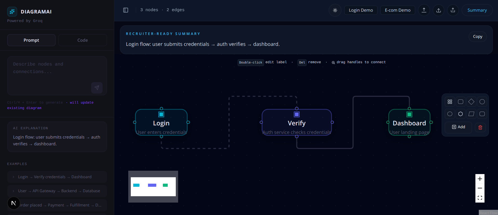

# DiagramAI

DiagramAI is an AI-powered diagram generator built with Next.js and React Flow. Users can describe a workflow in plain English, and the app generates a visual diagram with a recruiter-friendly explanation and export options.

## Screenshot



## Why this project stands out

- AI-assisted workflow generation from natural language prompts
- Interactive canvas for editing and connecting nodes
- Light and dark theme support for better presentation
- Recruiter-ready summary card for quick explanation during demos
- Demo flows for Login and E-commerce scenarios
- Export and import support for JSON, PNG, JPG, and PDF-style sharing

## Key features

- Generate diagrams from prompts using Groq AI
- Edit diagrams manually on the canvas
- Restore previous sessions from history
- Toggle between prompt and code view
- Share or export the current diagram easily

## Tech stack

- Next.js 16
- React 19
- TypeScript
- Tailwind CSS
- React Flow
- Groq SDK
- Lucide Icons

## Project structure

- `app/` — main app pages and API routes
- `components/` — UI and editor components
- `lib/` — types, utilities, and prompt helpers

## Getting started

1. Install dependencies
   ```bash
   npm install
   ```

2. Set up environment variables
   Create a `.env` file and add your Groq API key:
   ```bash
   GROQ_API_KEY=your_api_key_here
   ```

3. Run the development server
   ```bash
   npm run dev
   ```

4. Open your browser at
   ```text
   http://localhost:3000
   ```

## Demo ideas for recruiters

- Show how a user can describe a workflow in plain English
- Load the prebuilt Login Flow demo
- Load the E-commerce Flow demo
- Highlight the recruiter-ready summary and export/share features

## Build

```bash
npm run build
```

## License

This project is for demonstration and portfolio purposes.
